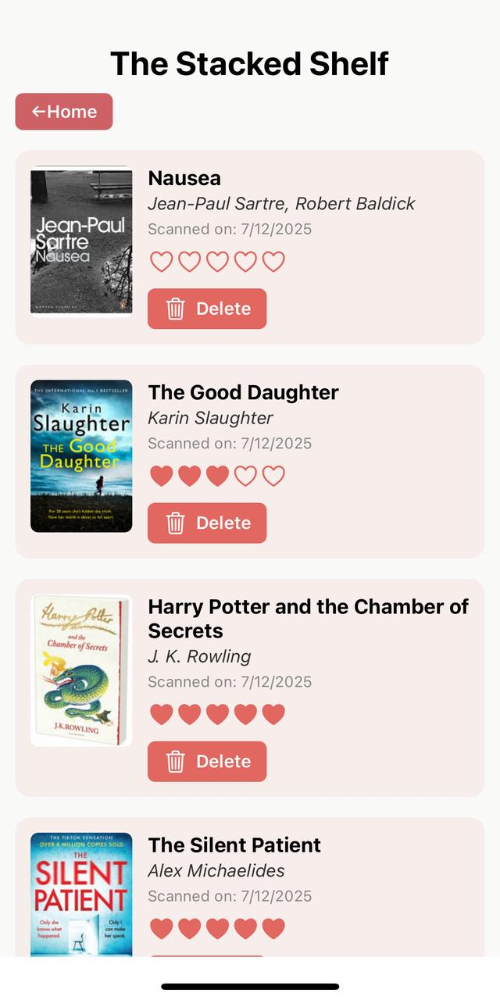
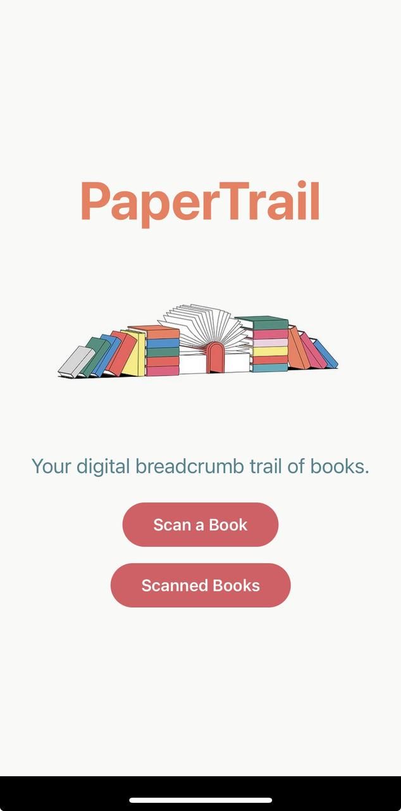

## Book Tracker App

A mobile application built using React Native and Expo that allows users to scan books using barcodes (ISBN), fetch book details from the Google Books API, and save them in a personal library using Firebase.

## Features

- Scan book barcodes using the device camera
- Fetch book metadata such as title, author, and cover image
- Store scanned books in Firebase Firestore
- View and manage scanned books in a library screen
- Rate books with a 1–5 heart system
- View the date when the book was scanned
- Delete books from the library

### Frontend

- React Native (with Expo)
- Expo Camera
- Expo Router
- Axios for API requests

### Backend

- Firebase Firestore (for storing scanned books)
- Google Books API (for fetching book data)

### Other Tools

- Environment variables via `.env` and Expo's `extra` configuration
- Firebase Authentication (optional, not enforced)

## Setup

1. Clone the repository.
2. Run `npm install` to install dependencies.
3. Add a `.env` file with your Firebase and Google Books API keys.
4. Run `npx expo start` to launch the app.

## Screenshots

### Scan Screen

### Library View

### Home Screen

